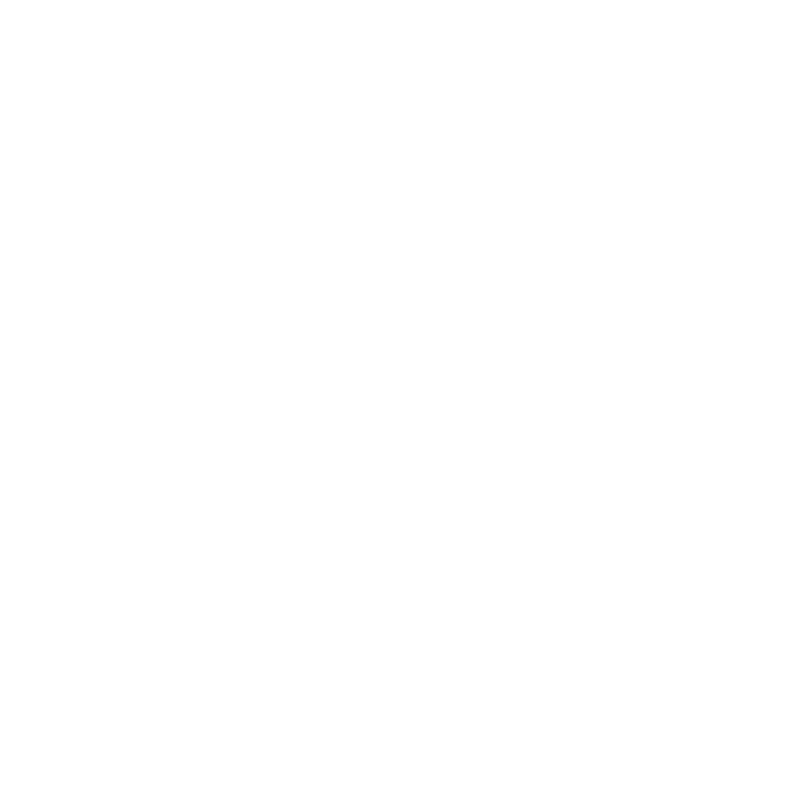

    <h1>
        
         
        Android Client of Oxygen Toolbox
    </h1>

    
    
    
    

# Overview ([ZH](README_zh.md), EN)

This project is an android application of Oxygen Toolbox.

# Get the App

    

# Supported Platforms

- \>= Android Nougat (7.0)
- \>= Android System WebView 80

# Related projects

[API of Oxygen Toolbox](https://github.com/FatttSnake/oxygen-api)

[Web UI of Oxygen Toolbox](https://github.com/FatttSnake/oxygen-ui)

[Desktop Client of Oxygen Toolbox](https://github.com/FatttSnake/oxygen-desktop)
